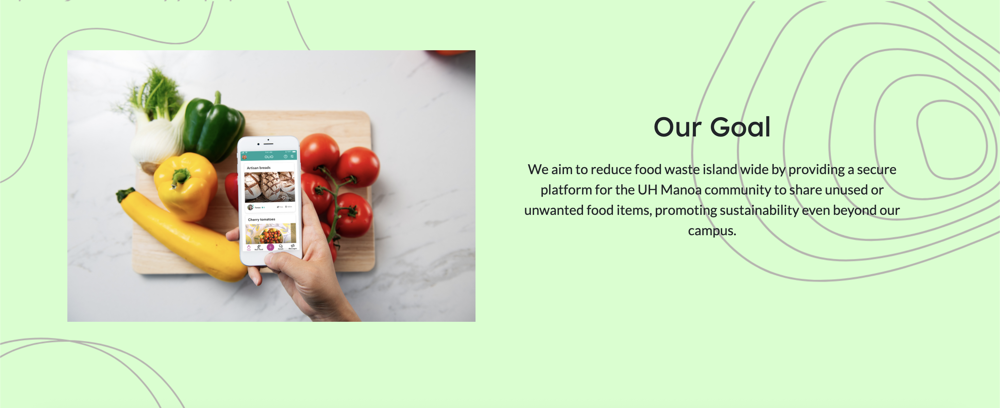
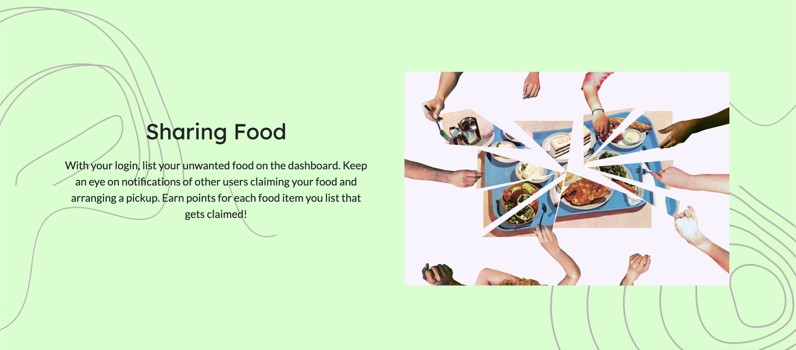
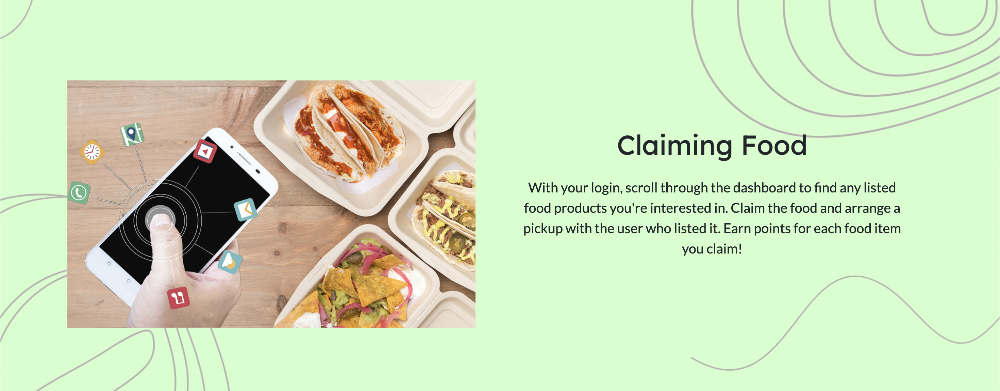
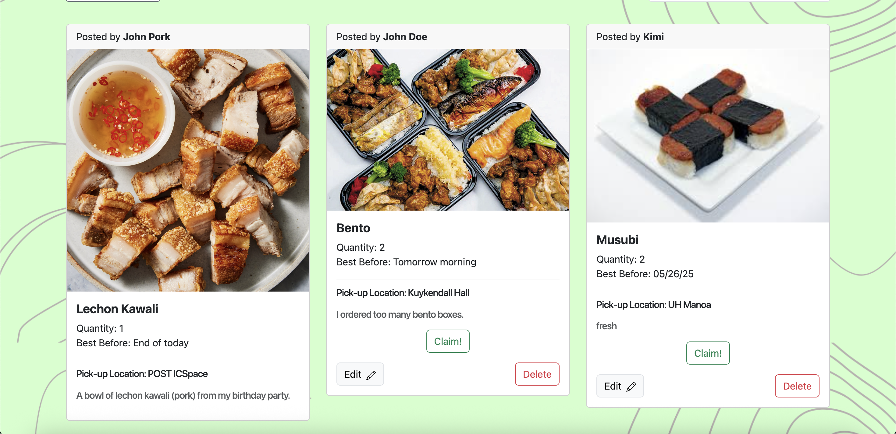
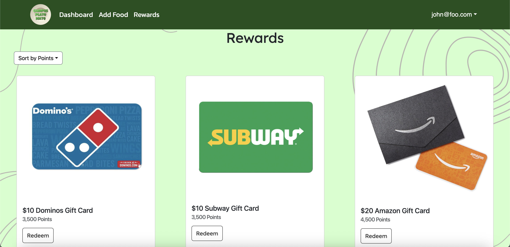
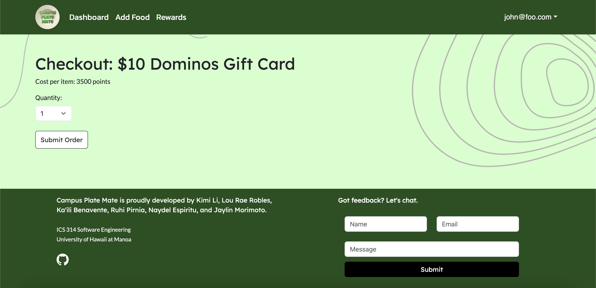
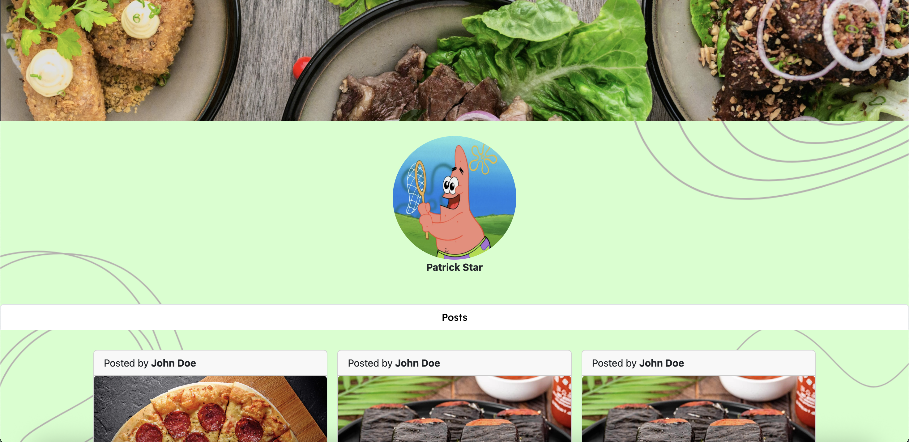

# Campus Plate Mate

## Table of contents

- [Overview](#overview)
- [Goals](#goals)
- [Developer Guide](#developer-guide)
- [User Guide](#user-guide)
- [Project Boards](#project-boards)
- [Team](#team)

## Overview

Campus Plate Mate is a web application that provides pages to share food and claim rewards. It illustrates various technologies useful to ICS software engineering students, including:

- [Next.js](https://nextjs.org/) which enables the creation of web applications with React components.
- [React](https://reactjs.org/) for component-based UI implementation and routing.
- [React Bootstrap](https://react-bootstrap.github.io/) CSS Framework for UI design.

## Goals

As a team, we plan on creating a website where users can offer up or exchange leftover or unused foods within the UH Manoa area. We want to utilize all skills learned while taking our software engineering class like creating data bases, programming pages for user interaction, and using UI and CSS tools for our website's design.

## User Guide

Below you can find a guide through our website:

[](https://github.com/campusplatemate/application/actions/workflows/ci.yml)

### Landing Page and Footer
The first page you see when you launch the application. Here, you will see a brief introduction to the website and its functionality.









On our footer, you can send us feedback on what to improve on!

### Sign In/Sign up Slider and Sign Out Page

Sign in page and Sign up page:


This is a slider form where you can choose to sign in or sign up (Create Account).

Sign out page:


### Add Food Page


From left to right, enter your Name, name of the Food, Image of the food, the Quantity you are giving away, the Location of pick up, the Best Before date, and a Description to create a post which will appear on the dashboard.

### Dashboard




This is where users post the food they want to give away. Only owners of the posts are able to edit or delete a post.

### Rewards Page






In our rewards page, you can redeem your points (which we unfortunately did not implement at the time of writing this) for rewards. You can choose the amount you want to order.

### Profile Page



## Community Feedback

We talked to five members of the UH community and had told us about the following:
- Get the claim button to work
- Add a navbar
- Move the location of the button when posting a food

## Developer Guide
- First, [install GitHub Desktop](https://desktop.github.com/).
- Second, go to [the Campus Plate Mate repo](https://github.com/campusplatemate/application), click the "Code" dropdown and clone the digits repo (i.e. using the "Open with GitHub Desktop" option).
- Third, cd into the app/ directory of your local copy of *Campus Plate Mate**, and install third party libraries via cmd or PowerShell:

```
$ npm install
```
- Fourth, once the libraries are installed, you can run the application by invoking the following:

```
$ npm run dev
```
- Lastly, navigate to http://localhost:3000 to see the application running.

### View Our Deployment

Take a look at our project's [deployment through Vercel](https://plate-mate-bice.vercel.app/).


## Project Boards

View the tasks we've completed for the project thus far for [Milestone 1](https://github.com/orgs/campusplatemate/projects/4), [Milestone 2](https://github.com/orgs/campusplatemate/projects/7) and [Milestone 3](https://github.com/orgs/campusplatemate/projects/8).

## Team

Campus Plate Mate is designed, implemented, and maintained by [Ka'ili Benavente](https://kailibenavente.github.io), [Kimi Qi](https://kqimi.github.io/), [Jaylin Morimoto](https://jaylin-m.github.io/), [Ruhi Pirnia](https://rpirnia.github.io/), [Naydel Espiritu](https://naydelly.github.io/), and [Lou Rae Robles](https://lrrobles.github.io/).

See our [Team Contract](https://docs.google.com/document/d/1ZBsPm5ipDgzuAGX94x4z-A-nNO2-lngPQzCGNLIbtNc/edit?usp=sharing).
