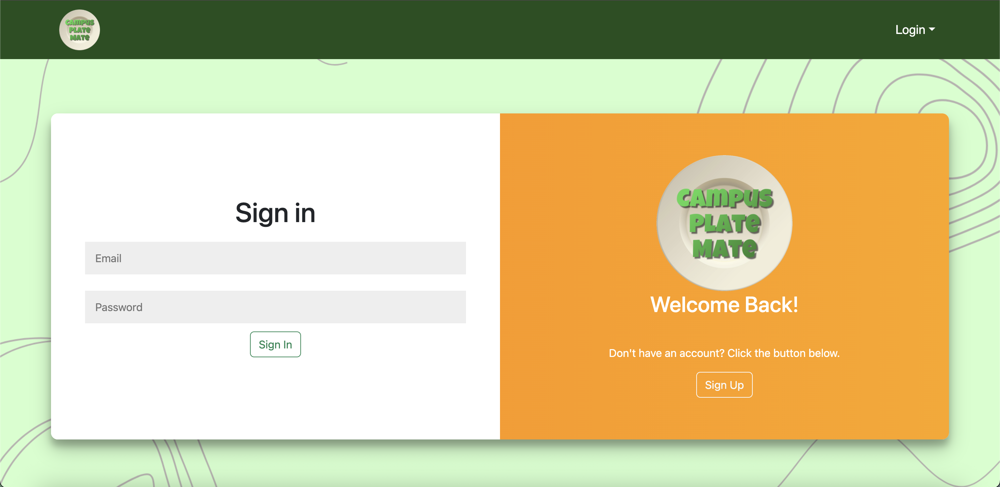

# Campus Plate Mate

## Table of contents

- [Overview](#overview)
- [Goals](#goals)
- [Mockup Ideas](#mockup-ideas)
- [Team](#team)

## Overview

Campus Plate Mate is a web application that provides pages to view and places to modify profiles, projects, and interests. It illustrates various technologies useful to ICS software engineering students, including:

- [Meteor](https://www.meteor.com/) for Javascript-based implementation of client and server code.
- [React](https://reactjs.org/) for component-based UI implementation and routing.
- [React Bootstrap](https://react-bootstrap.github.io/) CSS Framework for UI design.
- [Uniforms](https://uniforms.tools/) for React and Semantic UI-based form design and display.

## Goals

As a team, we plan on creating a website where users can offer up or exchange leftover or unused foods within the UH Manoa area. We want to utilize all skills learned while taking our software engineering class like creating data bases, programming pages for user interaction, and using UI and CSS tools for our website's design.

## Mockup Ideas

Regarding the look of our website, we want to include elements like a navigation bar, a center page, and a footer. We look to setups like these for inspiration while building our website:

### Sign In/Sign up Slider and Sign Out Page

Sign in page and Sign up page:

This is a slider form where you can choose to sign in or sign up (Create Account).

Sign out page:

### Add Food Page

### Rewards Page

### Profile Page

### About page

Before you log in, you can learn more about our project at the About page:

## Further Inspiration

For pages we have not constructed yet, here are our inspiration mockups!

### Home page

After logging in, you are taken to the home page, which presents a form where you can complete and/or update your personal profile:

### Plates page

Once you are logged in, you can view, request, or post meals with the Plates page:

## Team

Campus Plate Mate is designed, implemented, and maintained by [Ka'ili Benavente](https://kailibenavente.github.io), [Kimi Qi](https://kqimi.github.io/), [Jaylin Morimoto](https://jaylin-m.github.io/), [Ruhi Pirnia](https://rpirnia.github.io/), [Naydel Espiritu](https://naydelly.github.io/), and [Lou Rae Robles](https://lrrobles.github.io/).

See our [Team Contract](https://docs.google.com/document/d/1ZBsPm5ipDgzuAGX94x4z-A-nNO2-lngPQzCGNLIbtNc/edit?usp=sharing).
