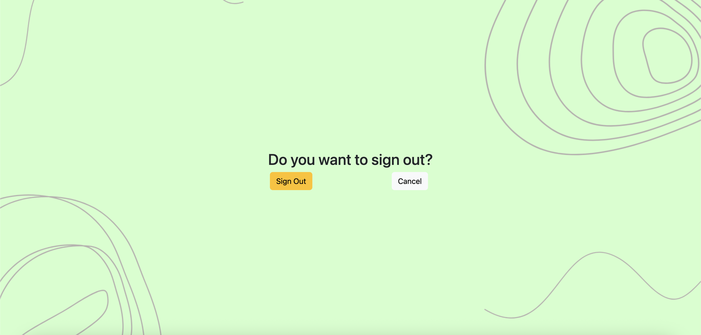
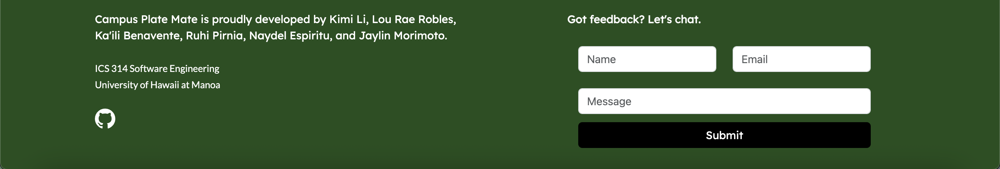

# Campus Plate Mate

## Table of contents

- [Overview](#overview)
- [Goals](#goals)
- [User Guide](#user-guide)
- [Developer Guide](#developer-guide)
- [Project Boards](#project-boards)
- [Team](#team)

## Overview

Campus Plate Mate is a web application that provides pages to view and places to modify profiles, projects, and interests. It illustrates various technologies useful to ICS software engineering students, including:

- [Meteor](https://www.meteor.com/) for Javascript-based implementation of client and server code.
- [React](https://reactjs.org/) for component-based UI implementation and routing.
- [React Bootstrap](https://react-bootstrap.github.io/) CSS Framework for UI design.
- [Uniforms](https://uniforms.tools/) for React and Semantic UI-based form design and display.

## Goals

As a team, we plan on creating a website where users can offer up or exchange leftover or unused foods within the UH Manoa area. We want to utilize all skills learned while taking our software engineering class like creating data bases, programming pages for user interaction, and using UI and CSS tools for our website's design.

## User Guide

Below you can find a guide through our website:

[](https://github.com/jaylin-m/campusplatemate/application/actions/workflows/ci.yml)

### Sign In/Sign up Slider and Sign Out Page

Sign in page and Sign up page:


This is a slider form where you can choose to sign in or sign up (Create Account).

Sign out page:



### Add Food Page


### Dashboard


### Rewards Page


### Profile Page


### About page and Footer

Before you log in, you can learn more about our project at the About page:




The footer allows the user to send feedback.

### View Our Deployment

Take a look at our project's [deployment through Vercel](https://plate-mate-bice.vercel.app/).


## Developer Guide
- First, [install GitHub Desktop](https://desktop.github.com/).
- Second, go to [the Campus Plate Mate repo](https://campusplatemate.github.io/), click the "Code" dropdown and clone the digits repo (i.e. using the "Open with GitHub Desktop" option).
- Third, cd into the app/ directory of your local copy of *Campus Plate Mate**, and install third party libraries via cmd or PowerShell:

```
$ npm install
```
- Fourth, once the libraries are installed, you can run the application by invoking the following:

```
$ npm run dev
```
- Lastly, navigate to http://localhost:3000 to see the application running.

## Project Boards

View the tasks we've completed for the project thus far for [Milestone 2](https://github.com/orgs/campusplatemate/projects/7) and [Milestone 3](https://github.com/orgs/campusplatemate/projects/8).

## Team

Campus Plate Mate is designed, implemented, and maintained by [Ka'ili Benavente](https://kailibenavente.github.io), [Kimi Qi](https://kqimi.github.io/), [Jaylin Morimoto](https://jaylin-m.github.io/), [Ruhi Pirnia](https://rpirnia.github.io/), [Naydel Espiritu](https://naydelly.github.io/), and [Lou Rae Robles](https://lrrobles.github.io/).

See our [Team Contract](https://docs.google.com/document/d/1ZBsPm5ipDgzuAGX94x4z-A-nNO2-lngPQzCGNLIbtNc/edit?usp=sharing).
